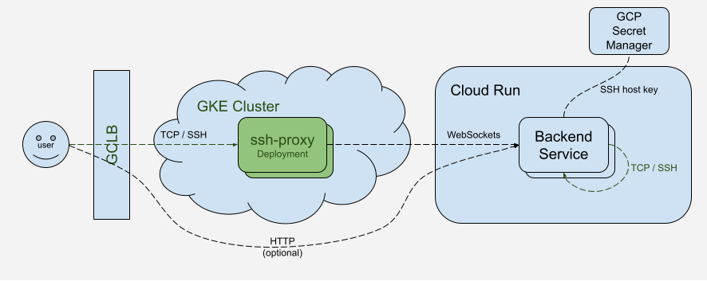

# SSH Proxy

A Go library and proxy server for tunneling SSH connections over WebSockets, designed for Cloud Run apps that don't support raw TCP connections.



## Overview

SSH Proxy provides two main functions:

1. **TCP → WebSocket Proxy** - Accepts TCP connections and forwards them to a WebSocket backend on Cloud Run.
2. **WebSocket → SSH Proxy** - Accepts WebSocket connections and forwards them to a local SSH server implementation.

This allows you to deploy SSH services on Cloud Run by tunneling SSH traffic over HTTP/WebSocket connections.

## Usage

### TCP → WebSocket Proxy

Use the SSH proxy program to forward local SSH connections to a WebSocket endpoint.

You can run this in [GKE Autopilot](https://cloud.google.com/kubernetes-engine/docs/concepts/autopilot-overview) for a minimal, cost-effective and low-maintenance environment to proxy requests.

### WebSocket → SSH Proxy

Create a WebSocket handler that forwards connections to a local SSH server:

```go
// TODO: run an SSH server on :22

// Forward WebSocket connections to local SSH server at :22
http.Handle("/ssh", sshproxy.ProxyWebSocketToSSH(":22", websocket.Upgrader{
    // Accept requests from all origins; consider changing this.
    CheckOrigin: func(r *http.Request) bool { return true },
}))
http.ListenAndServe(":8080", nil)
```

## Authentication

The proxy sends Google Cloud identity token authentication to the backend service. The backend service can be configured to only accept traffic from the proxy.
